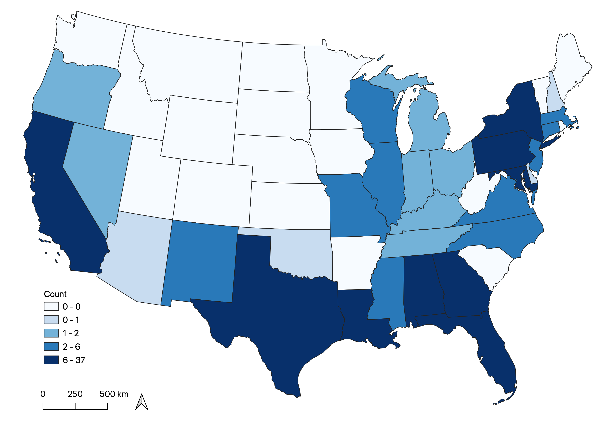

All maps represent the variable grouped by the participant's state of residence upon arrest, for respondents from both federal and state prisons.These spatial analyses may be heavily impacted by the distribution of large facilities in the prison system. 

The graduated color scale represents values corresponding to the number of respondents who reported 'Yes' to each variable. Categories were determined by quantiles with 5 groups. Maps were created by doing a spatial join in QGIS at the state level. 

## HIV Status

Based on state of residence upon arrest, it appears that a high proportion of respondents with at least one positive HIV test were form California, Texas, Florida, and states in the Northeast. 

## Mental Health History

A large number of respondents who reported to have had a history with at least one mental health condition come from California and Texas.

## Mental Health Treatment Prior to Arrest

Again, California and Texas lead the way with a large number of respondents having received some form of mental health treatment prior to arrest. 

## Mental Health Treatment After Admission

Interestingly, though the highest proportion of respondents who received some form of mental health treatment after admission come from California and Texas, there is an increase, compared to before arrest, for states in the Eastern Region. 

