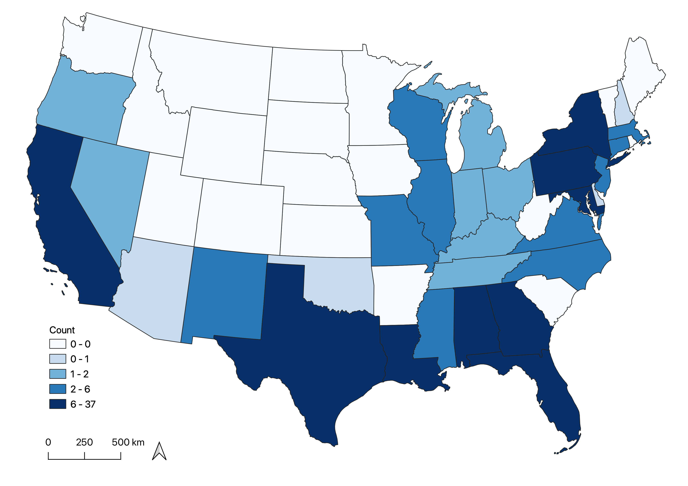
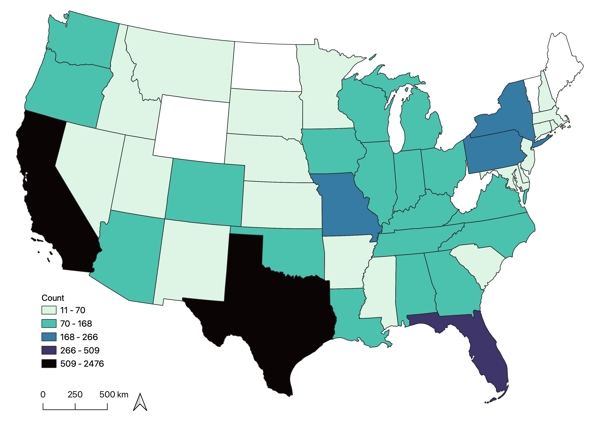
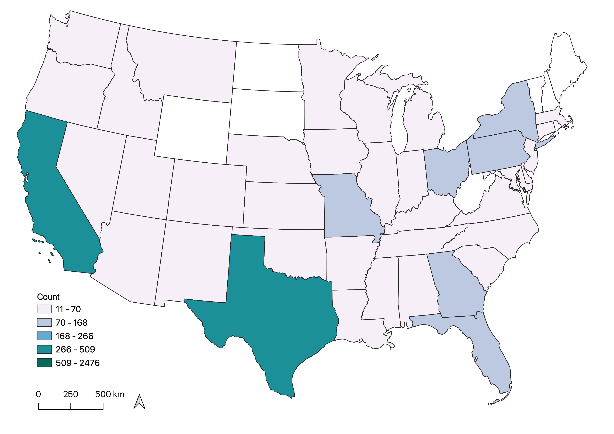
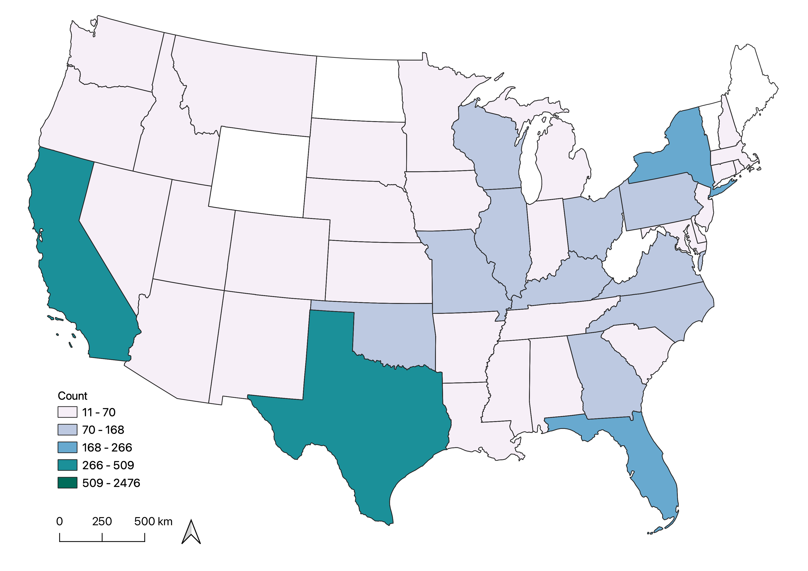

```{r setup, include=FALSE}
library(tidyverse)
library(mgcv)
library(modelr)
library(viridis)
library(labelled)
library(table1)
library(patchwork)
library(plotly)
library(dvmisc)


knitr::opts_chunk$set(
	echo = TRUE,
	warning = FALSE,
	fig.width = 8, 
  fig.height = 6,
  out.width = "100%"
)

options(
  ggplot2.continuous.colour = "viridis",
  ggplot2.continuous.fill = "viridis"
)

scale_colour_discrete = scale_colour_viridis_d
scale_fill_discrete = scale_fill_viridis_d

theme_set(theme_minimal() + theme(legend.position = "bottom"))
```

# Motivation 

Our group members are interested in studying HIV and mental health, so we chose to center our project on these outcomes. Additionally, we felt that focusing on incarcerated individuals would present an interesting lens through which to study these diseases due to this population’s elevated risk for HIV and mental health conditions and their often overlooked, disenfranchised status. Through this project, we aim to examine the prevalence of HIV and mental health conditions in the U.S. incarcerated population. Furthermore, we plan to examine the association between these conditions and assess how/whether one’s mental health history can be predicted using the variables from our dataset on incarcerated individuals.

# Related work

The prevalence of mass incarceration in the United States has grown drastically, driving severe disparities in individual and community health that persist over time. [Incarcerated individuals](https://www.sciencedirect.com/science/article/pii/S0140673617302593?casa_token=6to34x17J6EAAAAA:kRFrdxBYdGGIM4HXRarrOIO1M2Kpk6Yf1xGstv2To9PmRIRvzJEE0S1BK2W09gzVXrZbI9HM) have a higher risk of HIV, as well as mental health and substance use disorders, with little access to quality treatment despite prisons being required to provide healthcare. Furthermore, HIV/AIDS has been [clearly documented](https://www.nimh.nih.gov/health/topics/hiv-aids) to lead to an increased risk of mental health disorders in the general population. Inspired by this past research and gaps in knowledge about the incarcerated population, we hope to further examine these relationships in our analysis. In 2003 and 2004, the United States Bureau of Justice Statistics conducted a nationally representative survey to collect a variety of information, including current and past incarceration history and health status, on those incarcerated in federal and state prisons. This analysis will provide an overview on the differences in health status among incarcerated populations in both federal and state prison systems, specifically related to variables for HIV and mental health.

# Initial questions

Initially, we wanted to focus on HIV and mental health status in incarcerated individuals, but upon exploratory analysis of the dataset, we found a relatively low proportion of survey respondents with a positive HIV test and associated information on this subpopulation. We therefore shifted our analysis to primarily focus on mental health outcomes and also included variables related to respondents’ incarceration (`Number of Prior Sentences`, `Parents Been Incarcerated`, `Facility Type`, etc.).

Our three questions of interest include: 

1. Is mental health associated with HIV Status?
2. Is mental health associated with prior arrest history?
3. What are the best predictors of mental health status?

# Data
### Source

Our dataset, `Survey of Inmates in State and Federal Correctional Facilities, [United States], 2004 (ICPSR 4572)`, was collected from a nationally representative survey of incarcerated individuals in both state and federal prison systems. Versions of this cross-sectional study have been conducted every 5-6 years since 1974. The dataset used for this analysis can be found [here](https://www.icpsr.umich.edu/web/NACJD/studies/4572). This dataset contains information about thousands of randomly sampled incarcerated individuals, including variables regarding demographics, prison sentence and history with the judicial system, as well as health. 

### Cleaning

To conduct our exploratory and statistical data analyses, we first imported the datasets containing observations of both state and federally incarcerated individuals from the `Survey of Inmates in State and Federal Correctional Facilities, [United States], 2004 (ICPSR 4572)` into R. We also selected our variables of interest to pare down the datasets. This was necessary as the original datasets were extremely extensive with several thousand variables in addition to several thousand individual observations. Paring down the datasets not only aided with ease of scanning the original dataset for errors and successful completion of coding steps, but it was also key to avoiding long run-times while developing the code.

```{r import}
#Importing the datasets
federal_df <- load("./data/04572-0001-Data.rda") 

federal_df <- da04572.0001 %>% 
  select(V2288, V2289, V2290, V2291, MCMH_HIVTEST, MCMH_RSLT_HIV, DRUG_INJECT_CB, V2401, V2402, V2403, V2404, V2405, V2406, V2407, V2409, V2412, MCMH_MH_TREATMENT_PA, MCMH_MH_TREATMENT_AD, MCMH_MENTAL_HISTORY, V1197, CS_SENTENCEMTH,CH_PRIORSENTENCE, CH_PRIORSENTENCE_NUM, CH_CRIMHIST, CH_CRIMHIST_COLLAPSED, CH_NUMCAR,CH_NUMCAR1, CH_NUMCAR2, CH_NUMCAR3, CH_NUMCAR4, CH_NUMCAR5, MOST_SERIOUS_OFFENSE2, TYPEOFFENSE, V1056, V1057, V1060, V1061, V1325, V0001, V0014, AGE_CAT, V2982, V0005, EDUCATION, SES_INCOMEMTH, DRUG_ANY, DRUG_ANYREG, DRUG_ANYMTH, SES_PHYSSEXABUSED_EVER, SES_PARENTS_INCARCERATED, SES_FAMILY_INCARCERATED, V0105, MCMH_WHEN_DISORDER, MCMH_WHEN_DISORDER2,MCMH_MHOSPYR,MCMH_MHOSPADM,MCMH_MHOSPYRADM,MCMH_SMI) %>%
  mutate(dataset = "Federal")

state_df <- load("./data/04572-0002-Data.rda") 

state_df <- da04572.0002 %>% 
   select(V2288, V2289, V2290, V2291, MCMH_HIVTEST, MCMH_RSLT_HIV, DRUG_INJECT_CB, V2401, V2402, V2403, V2404, V2405, V2406, V2407, V2409, V2412, MCMH_MH_TREATMENT_PA, MCMH_MH_TREATMENT_AD, MCMH_MENTAL_HISTORY, V1197, CS_SENTENCEMTH,CH_PRIORSENTENCE, CH_PRIORSENTENCE_NUM, CH_CRIMHIST, CH_CRIMHIST_COLLAPSED, CH_NUMCAR,CH_NUMCAR1, CH_NUMCAR2, CH_NUMCAR3, CH_NUMCAR4, CH_NUMCAR5, MOST_SERIOUS_OFFENSE2, TYPEOFFENSE, V1056, V1057, V1060, V1061, V1325, V0001, V0014, AGE_CAT, V2982, V0005, EDUCATION, SES_INCOMEMTH, DRUG_ANY, DRUG_ANYREG, DRUG_ANYMTH, SES_PHYSSEXABUSED_EVER, SES_PARENTS_INCARCERATED, SES_FAMILY_INCARCERATED, V0105, MCMH_WHEN_DISORDER, MCMH_WHEN_DISORDER2,MCMH_MHOSPYR,MCMH_MHOSPADM,MCMH_MHOSPYRADM,MCMH_SMI) %>%
  mutate(dataset = "State")
```

We next stacked these two datasets (i.e., federal and state) and cleaned the resulting data by checking for coding errors, recoding various factor variables for ease of viewing, adding variable labels, and changing the coding of values from `missing`/`don't know`/`unknown` to `NA` for consistency.

```{r combine_clean}
#Combining datasets, filtering dataset, formatting variables
total_df = 
  bind_rows(state_df, federal_df) %>% 
  mutate(
    dataset = as.factor(dataset)) %>%
  mutate(
    MENTAL_HISTORY_BINARY = case_when(MCMH_MENTAL_HISTORY == "(0000001) Yes" ~ "1", MCMH_MENTAL_HISTORY == "(0000002) No" ~ "0", MCMH_MENTAL_HISTORY == "(9999997) DK/refused" | MCMH_MENTAL_HISTORY == "(9999999) Blank"  ~ ".")) %>%
  mutate(
    MENTAL_HISTORY_BINARY = na_if(MENTAL_HISTORY_BINARY, "."), 
    MENTAL_HISTORY_BINARY = factor(MENTAL_HISTORY_BINARY, 
      levels = c(0, 1),
      labels = c("No history of mental health condition(s)", "History of mental health condition(s)")))  %>% 
  filter(!is.na(MENTAL_HISTORY_BINARY)) %>% 
  mutate(V0005 = dplyr::recode(V0005, "(1) Male" = "Male", "(2) Female" = "Female")) %>% 
  mutate(AGE_CAT = dplyr::recode(AGE_CAT, "(1) < 25 yrs" = "< 25 yrs", "(2) 25-34" = "25-34", "(3) 35-44" =  "35-44", "(4) 45-54" = "45-54", "(5) 55-64" = "55-64", "(6) 65-96" = "65-96", "(7) Unknown" = "Unknown")) %>% 
  mutate(
    V2982 = dplyr::recode(V2982, "(1) White non-Hispanic" = "White non-Hispanic", "(2) Black non-Hispanic" = "Black non-Hispanic", "(3) Hispanic" = "Hispanic", "(4) American Indian, Alaska Native non-Hispanic" = "American Indian, Alaska Native non-Hispanic", "(5) Asian, Pacific Islander, Native Hawaiian non-Hispanic" = "Asian, Pacific Islander, Native Hawaiian non-Hispanic", "(6) Multiple Races reported, non-Hispanic" = "Multiple Races reported, non-Hispanic", "(8) Other, Uncategorized - Missing" = "NA"), 
    V2982 = factor(V2982, exclude = "NA"), 
    V2982 = na_if(V2982, "NA")) %>% 
  mutate(
    EDUCATION = dplyr::recode(EDUCATION, "(0000000) Never attended or attended kindergarten only" = "Never attended or kindergarten only", "(0000001) First grade" = "First grade", "(0000002) Second grade" = "Second grade", "(0000003) Third grade" = "Third grade", "(0000004) Fourth grade" = "Fourth grade", "(0000005) Fifth grade" = "Fifth grade", "(0000006) Sixth grade" = "Sixth grade", "(0000007) Seventh grade" = "Seventh grade", "(0000008) Eighth grade" = "Eighth grade", "(0000009) Ninth grade" = "Ninth grade", "(0000010) Tenth grade" = "Tenth grade", "(0000011) Eleventh grade" = "Eleventh grade", "(0000012) Twelfth grade" = "Twelfth grade", "(0000013) College freshman" = "College freshman", "(0000014) College sophomore" = "College sophomore", "(0000015) College junior" = "College junior", "(0000016) College senior" = "College senior", "(0000017) Graduate school one year" = "Graduate school one year", "(0000018) Graduate school two or more years" = "Graduate school two or more years", "(0000019) Attended school in other country/system not comparable to grades" = "NA", "(9999997) Don't know" = "NA", "(9999998) Refused" = "NA", "(9999999) Missing" = "NA"), 
    EDUCATION = factor(EDUCATION, exclude = "NA"), 
    EDUCATION = na_if(EDUCATION, "NA")) %>% 
  mutate(
    SES_INCOMEMTH = dplyr::recode(SES_INCOMEMTH, "(0000000) No income" = "No income", "(0000001) $1 - 199" = "$1 - $199", "(0000002) 200 - 399" = "$200 - $399", "(0000003) 400 - 599" = "$400 - $599", "(0000004) 600 - 799" = "$600 - $799", "(0000005) 800 - 999" = "$800 - $999", "(0000006) 1,000 - 1,199" = "$1,000 - $1,199", "(0000007) 1,200 - 1,499" = "$1,200 - $1,499", "(0000008) 1,500 - 1,999" = "$1,500 - $1,999", "(0000009) 2,000 - 2,499" = "$2,000 - $2,499", "(0000010) 2,500 - 4,999" = "$2,500 - $4,999", "(0000011) 5,000 - 7,499" = "$5,000 - $7,499", "(0000012) 7,500 or more" = "$7,500 or more", "(9999997) Don't know" = "NA", "(9999998) Refused" = "NA", "(9999999) Missing" = "NA"), 
    SES_INCOMEMTH = factor(SES_INCOMEMTH, exclude = "NA"), 
    SES_INCOMEMTH = na_if(SES_INCOMEMTH, "NA")) %>% 
  mutate(
    CH_PRIORSENTENCE_NUM = dplyr::recode(CH_PRIORSENTENCE_NUM, "(0000000) No prior sentence" = "No prior sentence", "(0000001) One prior sentence" = "One prior sentence", "(0000002) Two prior sentences" = "Two prior sentences", "(0000003) Three to five prior sentences" = "Three to five prior sentences", "(0000004) Six to ten prior sentences" = "Six to ten prior sentences", "(0000005) Eleven or more prior sentences" = "Eleven or more prior sentences", "(9999999) Missing" = "NA"), 
    CH_PRIORSENTENCE_NUM = factor(CH_PRIORSENTENCE_NUM, exclude = "NA"), 
    CH_PRIORSENTENCE_NUM = na_if(CH_PRIORSENTENCE_NUM, "NA")) %>% 
    mutate(
    V1197 = ifelse(V1197 <= 996, V1197, NA)) %>% 
  mutate(
    CH_CRIMHIST_COLLAPSED = dplyr::recode(CH_CRIMHIST_COLLAPSED, "(0000001) First timers" = "First timers", "(0000002) Recidivist, current or past violent offense" = "Recidivist, current or past violent offense", "(0000003) Recidivist, no current or prior violent offense" = "Recidivist, no current or prior violent offense", "(9999999) Missing" = "NA"), 
    CH_CRIMHIST_COLLAPSED = factor(CH_CRIMHIST_COLLAPSED, exclude = "NA"), 
    CH_CRIMHIST_COLLAPSED = na_if(CH_CRIMHIST_COLLAPSED, "NA")) %>% 
  mutate(
    SES_PARENTS_INCARCERATED = dplyr::recode(SES_PARENTS_INCARCERATED, "(0000001) Yes" = "Yes", "(0000002) No" = "No","(9999997) Don't know" = "NA", "(9999998) Refused" = "NA", "(9999999) Missing" = "NA"), 
    SES_PARENTS_INCARCERATED = factor(SES_PARENTS_INCARCERATED, exclude = "NA"), 
    SES_PARENTS_INCARCERATED = na_if(SES_PARENTS_INCARCERATED, "NA")) %>% 
  mutate(
    SES_FAMILY_INCARCERATED = dplyr::recode(SES_FAMILY_INCARCERATED, "(0000001) Yes" = "Yes", "(0000002) No" = "No","(9999997) Don't know" = "NA", "(9999998) Refused" = "NA", "(9999999) Missing" = "NA"), 
    SES_FAMILY_INCARCERATED = factor(SES_FAMILY_INCARCERATED, exclude = "NA"), 
    SES_FAMILY_INCARCERATED = na_if(SES_FAMILY_INCARCERATED, "NA")) %>% 
  mutate(
      V2409 = dplyr::recode(V2409, "(1) Yes" = "Yes", "(2) No" = "No","(7) Don't Know" = "NA", "(8) Refused" = "NA"), 
      V2409 = factor(V2409, exclude = "NA"), 
      V2409 = na_if(V2409, "NA")) %>% 
  mutate(
      V2412 = dplyr::recode(V2412, "(1) Yes" = "Yes", "(2) No" = "No","(7) Don't Know" = "NA", "(8) Refused" = "NA"), 
      V2412 = factor(V2412, exclude = "NA"), 
      V2412 = na_if(V2412, "NA")) %>% 
  mutate(
      MCMH_MHOSPYR = dplyr::recode(MCMH_MHOSPYR, "(0000001) Yes, admitted to mental hospital during the 12 months before arrest" = "Yes in 12 months before arrest", "(0000002) No, was not admitted to mental hospital during the 12 months before arrest" = "Not in 12 months before arrest", "(0000004) No, never admitted to stayed overnight at mental hospital" = "No, never", "(9999998) DK/refused" = "NA", "(9999999) Missing" = "NA"), 
      MCMH_MHOSPYR = factor(MCMH_MHOSPYR, exclude = "NA"), 
      MCMH_MHOSPYR = na_if(MCMH_MHOSPYR, "NA")) %>% 
  mutate(
    MCMH_MHOSPADM = dplyr::recode(MCMH_MHOSPADM, "(0000001) Yes, admitted to mental hospital since admission" = "Yes since admission", "(0000002) No, was not admitted to mental hospital since admission" = "Not since admission", "(0000004) No, never admitted to stayed overnight at mental hospital" = "No, never", "(9999998) DK/refused" = "NA", "(9999999) Missing" = "NA"), 
      MCMH_MHOSPADM = factor(MCMH_MHOSPADM, exclude = "NA"), 
      MCMH_MHOSPADM = na_if(MCMH_MHOSPADM, "NA")) %>% 
  mutate(
    MCMH_RSLT_HIV = dplyr::recode(MCMH_RSLT_HIV, "(0000001) At least one positive test" = "Positive", "(0000002) At least one negative and the other unknown" = "Presumed Negative", "(0000009) Missing" = "NA", "(9999999) Missing" = "NA"), 
      MCMH_RSLT_HIV = factor(MCMH_RSLT_HIV, exclude = "NA"), 
      MCMH_RSLT_HIV = na_if(MCMH_RSLT_HIV, "NA")) %>% 
  mutate(
    TYPEOFFENSE = gsub(".*)", "", TYPEOFFENSE), 
    TYPEOFFENSE = dplyr::recode(TYPEOFFENSE, " Missing" = "NA", " DK/refused" = "NA", " Blank" = "NA"),
    TYPEOFFENSE = na_if(TYPEOFFENSE, "NA"),
    TYPEOFFENSE = as.factor(TYPEOFFENSE)) %>% 
  set_variable_labels(dataset = "Facility Type", MENTAL_HISTORY_BINARY = "Binary Mental Health History", V0005 = "Sex", AGE_CAT = "Age Group", V2982 = "Race/Ethnicity", EDUCATION = "Education", SES_INCOMEMTH = "Monthly Income in Month Before Arrest", CH_PRIORSENTENCE_NUM = "Number of Prior Sentences", V1197 = "Number of Prior Arrests", CH_CRIMHIST_COLLAPSED = "Collapsed Criminal History", TYPEOFFENSE = "Type of Offense", SES_PARENTS_INCARCERATED = "Parents Been Incarcerated", SES_FAMILY_INCARCERATED = "Children, Siblings, or Spouse Been Incarcerated", MCMH_RSLT_HIV = "HIV Status")
```

This tidying and cleaning resulted in a combined dataset with `r nrow(total_df)` rows (observations) and `r ncol(total_df)` columns (variables). The resulting dataset includes demographic, geographic, incarceration-related, and health-related variables. In the subsequent analyses, we utilized the following variables:

* `V0005` - Sex, male or female
* `AGE_CAT` - Age category
* `V2982` - Race and ethnicity
* `EDUCATION` - Before admission, highest grade of school attended
* `SES_INCOMEMTH` - Month before arrest monthly income
* `CH_PRIORSENTENCE_NUM` - Number of prior sentences to probation or incarceration
* `V1197` - # of Times Arrested Controlling Arrest Date
* `CH_CRIMHIST_COLLAPSED` - Criminal history collapsed, categorical 
* `SES_PARENTS_INCARCERATED` - Parents have ever been in prison or jail 
* `SES_FAMILY_INCARCERATED` - Children, brothers, sisters, or spouse have ever been in jail or prison
* `TYPEOFFENSE` - Type of Offense
* `V2409` - Ever taken a medication for mental conditions 
* `V2412` - Taken medication for a mental condition since admission
* `MCMH_MHOSPYR` - Mental Hospital - year before arrest 
* `MCMH_MHOSPADM` - Mental hospital - since admission
* `MCMH_MH_TREATMENT_PA` - Mental Health Treatment 1 year prior to arrest
* `MCMH_MH_TREATMENT_AD` - Mental Health Treatment since admission
* `MCMH_RSLT_HIV` - HIV test result 


We created the following variables:

* `dataset` - federal or state
* `MENTAL_HISTORY_BINARY` - whether or not the respondent had any history with mental health conditions 
* `tx_pa_ad` - Treatment 1 Year Before Arrest/Since Admission

# Exploratory analysis

For our exploratory analyses, we examined the distribution of the variables listed above in our combined state and federal dataset by mental health history status, as this was our primary outcome of interest in the project.

### Demographics

To display the distribution of demographic factors by mental health history status, we  created a tabular visualization for any continuous variables and categorical variables with a small amount of factor levels/categories. We chose to utilize bar graphs to display the distribution of categorical exposure variables with numerous categories, as this type of graphical summary (as opposed to a histogram, line graph, density plot, etc.)  is appropriate for nominal categorical variables. Furthermore, we felt that including them in our tabular summary would be too lengthy and difficult to interpret for viewers. While some of our categorical variables could have potentially been treated as continuous (e.g., educational attainment), we felt that this would be an oversimplification for our regression analyses, as doing so relies on the assumption that the relationship between the exposure (e.g., educational attainment) and outcome (i.e., mental health history) is linear. However, we suspected that any one-unit change in exposure level would not necessarily result in the same average change in outcome, and thus treating such variables as nominal categorical was more appropriate.

<br>

#### Distribution of demographic variables, including sex (`V0005`), age group (`AGE_CAT`), and race/ethnicity (`V2982`)

```{r demographics, message=FALSE}
#Demographics Table
table1(~ V0005 + AGE_CAT + V2982 | MENTAL_HISTORY_BINARY, data = total_df, overall = "Total")
```

<br>

From this table, we can see that certain variables appear to differ by mental health history, one of our primary outcomes of interest. Therefore, we have performed some hypothesis testing on the [Statistical Analysis](stat_tests.html) page to assess whether the observed differences are significant.  
  
<br>

#### Educational Attainment by Mental Health History

```{r edu, message=FALSE}
#Bar Graph for EDUCATION
education_bar = 
  total_df %>% 
  group_by(MENTAL_HISTORY_BINARY, EDUCATION) %>% 
  summarise(n = n()) %>%
  mutate(freq = n / sum(n)) %>%
  rename(MH_History = MENTAL_HISTORY_BINARY) %>%
  ungroup() %>% 
  ggplot(aes(x = EDUCATION, y = freq, fill = MH_History)) +
  geom_bar(position = "dodge", stat = "identity") + 
  theme(axis.text.x = element_text(angle = 60, hjust = 1)) +
  labs(
    x = "Education",
    y = "Proportion of Total")+
  guides(fill=guide_legend(title="Mental Health History"))

ggplotly(education_bar)
```

When displayed on a bar graph, the two groups of mental health history have similar distributions of educational attainment, but categories from 10th-12th grade appear to have higher proportions of individuals with no mental health history, whereas the college-level categories interestingly have a higher proportion of individuals *with* a history of mental health condition(s).

<br>

#### Income in Month Before Arrest by Mental Health History  

```{r income, message=FALSE}
#BAR graph for SES_INCOMEMTH
income_bar = 
  total_df %>% 
  group_by(MENTAL_HISTORY_BINARY, SES_INCOMEMTH) %>% 
  summarise(n = n()) %>%
  mutate(freq = n / sum(n)) %>%
  rename(MH_History = MENTAL_HISTORY_BINARY) %>%
  ungroup() %>% 
  ggplot(aes(x = SES_INCOMEMTH, y = freq, fill = MH_History)) +
  geom_bar(position = "dodge", stat = "identity") + 
  theme(axis.text.x = element_text(angle = 45, hjust = 1)) +
   labs(x = "Monthly Income in Month Before Arrest",
        y = "Percentage of Individuals") +
  guides(fill=guide_legend(title="Mental Health History"))

ggplotly(income_bar)
```
  
With regard to monthly income in the month before arrest, the two categories of mental health history do not have easily distinguishable patterns/distributions. However, in the lower income categories (up to the `$800 - $999` category), there are a higher proportion of individuals with a history of mental health condition(s) - the opposite is true for all categories including and above `$1,000 - $1,199`.  
  
<br> 

### Incarceration

A similar approach was taken for incarceration-related factors, with a tabular summary created for most variables. The tabular summaries included are akin to what would be presented as the “Table 1” in an epidemiological study/article, which provides basic context about the distribution of key variables in a population as a precursor to explanatory analysis of their relationships to one another. A density plot was provided for our continuous variable of number of prior arrests as we would be using this variable in our subsequent regression analysis, while a bar graph was deemed appropriate to display the nominal variable of type of offense.

<br>

#### Distribution of Incarceration-Related Variables by Mental Health History 

We created to display the distribution of variables related to individuals' current incarceration and/or history within the justice system. These variables include number of prior sentences (`CH_PRIORSENTENCE_NUM`), number of prior arrests (`V1197`), collapsed criminal history (`CH_CRIMHIST_COLLAPSED`), whether their parents have been incarcerated (`SES_PARENTS_INCARCERATED`), whether their other immediate family has been incarcerated (`SES_FAMILY_INCARCERATED`), and whether they are incarcerated in a state or federal facility (`dataset`).

```{r incarceration, message=FALSE}
#Incarceration table
table1(~ CH_PRIORSENTENCE_NUM + V1197 + CH_CRIMHIST_COLLAPSED + SES_PARENTS_INCARCERATED + SES_FAMILY_INCARCERATED + dataset | MENTAL_HISTORY_BINARY, data = total_df, overall = "Total")
```

<br>

Again, some of these distributions appear to differ by mental health history status, so some hypothesis testing is performed on the Statistical Analysis page of the website to examine this further.  
  
#### Type of Offense by Mental Health History

```{r offense, message=FALSE}
#Bar graph fir TYPEOFOFFENSE
offense_bar = 
  total_df %>% 
  group_by(MENTAL_HISTORY_BINARY, TYPEOFFENSE) %>% 
  summarise(n = n()) %>%
  mutate(freq = n / sum(n)) %>%
  mutate(TYPEOFFENSE = fct_reorder(TYPEOFFENSE, -freq)) %>% 
  rename(MH_History = MENTAL_HISTORY_BINARY) %>%
  ungroup() %>% 
  ggplot(aes(x = TYPEOFFENSE, y = freq, fill = MH_History)) +
  geom_bar(position = "dodge", stat = "identity") + 
  theme(axis.text.x = element_text(angle = 45, hjust = 1)) +
   labs(x = "Type of Offense",
        y = "Percentage of Individuals") +
  guides(fill=guide_legend(title="Mental Health History"))

ggplotly(offense_bar)
```

The above bar graph shows that the two most common types of offense for both categories of mental health history are drug trafficking and robbery, while arson and other property crimes are the least common for both categories.  
  
<br>

#### Number of Prior Arrests by Mental Health History  

```{r prior_arrests, message=FALSE}
#Density plot for V1197
arrests_density = 
  total_df %>% 
  rename(MH_History = MENTAL_HISTORY_BINARY) %>%
  ggplot(data = ., aes(x = V1197)) +
  geom_density(aes(color = MH_History)) +
  labs(x = "Number of Prior Arrests") +
  guides(fill=guide_legend(title="Mental Health History"))

ggplotly(arrests_density)

```

The density plot above shows that the distributions of the number of prior arrests are extremely similar for both categories of mental health history. Most of the same peaks are observed in each distribution, suggesting there may be something significant about these seemingly arbitrary numbers of arrests. However, it does seem like a higher proportion of individuals with no mental health history have 0 to roughly 5 arrests compared to inmates with mental health condition(s).  

<br>


### Mental Health 

Because we had relatively few mental health variables and we were not attempting to display their distribution across mental health history categories, we chose to display them through bar graph visualizations. Examining the distribution of various, more niche mental-health-related outcomes such as hospitalizations and medication utilization provided us with insight into our population and behavioral trends. However, because observations recorded for these variables were almost exclusively inherent subsets of the group with a history of mental health condition(s), we felt they were too small of sample sizes to utilize as meaningful outcomes for further explanatory and statistical analyses.  

  
<br>

#### Medication for Mental Health (Ever and Since Admission)

```{r meds, message=FALSE}
#Stacked bar graph for V2409 and V2412
stacked_bar = 
  total_df %>% 
  filter(V2409 == "Yes" | V2409 == "No") %>%
  filter(V2412 != "(7) Don't know") %>% 
  group_by(V2409, V2412) %>% 
  summarise(n = n()) %>%
  ggplot(., aes(fill = V2412, y = n, x = V2409)) + 
  geom_bar(position = 'stack', stat = 'identity') +
  theme_minimal() + 
  labs(x = 'Ever Taken Medication for Mental Health', y = 'Number of Individuals') +
  scale_fill_manual('Taken Medication for Mental \nHealth Since Admission', values = c('dark green', 'steelblue'))

ggplotly(stacked_bar)
```

Less than half of individuals surveyed have ever taken medication for a mental health condition, but among those who have, most have taken such medication since their admission/incarceration. 

<br>

#### Mental Health Hospitalization 

```{r hosp, message=FALSE}
# Bar graph of MCMH_MHOSPYR
hosp_year = 
  total_df %>% 
  group_by(MCMH_MHOSPYR) %>% 
  summarise(n = n()) %>%
  mutate(freq = n / sum(n)) %>%
  drop_na() %>% 
  mutate(MCMH_MHOSPYR = fct_reorder(MCMH_MHOSPYR, freq)) %>% 
  ungroup() %>% 
  ggplot(aes(x = MCMH_MHOSPYR, y = freq)) +
  geom_bar(position = "dodge", stat = "identity", fill = "dark blue") + 
  theme(axis.text.x = element_text(angle = 45, hjust = 1)) + 
  theme(legend.position = "none") +
  labs(x = "Hospitalized for mental health, year before arrest", y = "Proportion of Individuals") 

# Bar graph of MCMH_MHOSPADM
hosp_adm = 
  total_df %>% 
  group_by(MCMH_MHOSPADM) %>% 
  summarise(n = n()) %>%
  mutate(freq = n / sum(n)) %>%
  drop_na() %>% 
  mutate(MCMH_MHOSPADM = fct_reorder(MCMH_MHOSPADM, freq)) %>% 
  ungroup() %>% 
  ggplot(aes(x = MCMH_MHOSPADM, y = freq)) +
  geom_bar(position = "dodge", stat = "identity", fill = "dark blue") + 
  theme(axis.text.x = element_text(angle = 45, hjust = 1)) + 
  theme(legend.position = "none") +
  labs(x = "Hospitalized for mental health, since admission", y = "Proportion of Individuals") 

hosp_year + hosp_adm

```
  
<br>  
  
#### Treatment Continuation (mental health treatment one year prior to arrest and since admission)
```{r trt, message=FALSE}
# Line graph for MH treatment continuation (one year prior to arrest and since admission)

total_df %>%
  filter(MENTAL_HISTORY_BINARY == "History of mental health condition(s)") %>%
  group_by(MCMH_MH_TREATMENT_PA, MCMH_MH_TREATMENT_AD) %>%
  mutate(
    MCMH_MH_TREATMENT_PA = gsub(".* ", "", MCMH_MH_TREATMENT_PA),
    MCMH_MH_TREATMENT_AD = gsub(".* ", "", MCMH_MH_TREATMENT_AD),
    tx_pa_ad = str_c(MCMH_MH_TREATMENT_PA, '/', MCMH_MH_TREATMENT_AD)) %>%
  ungroup() %>%
  group_by(tx_pa_ad) %>%
  summarise(n = n()) %>%
  mutate(freq = n / sum(n)) %>%
  ggplot(aes(x = tx_pa_ad, y = freq)) +
  geom_bar(position = "dodge", stat = "identity", fill = "dark red") + 
  theme(axis.text.x = element_text(angle = 45, hjust = 1)) + 
  theme(legend.position = "none") +
  labs(x = "Treatment Continuation: (Treatment 1 Year Before Arrest/Since Admission)", y = "Proportion of Individuals") 
```

The bar graph above restricts our analysis of treatment continuation to only those individuals with a history of mental health condition(s) as indicated by the `MENTAL_HISTORY_BINARY` variable. Among those survey respondents, it found that roughly two-thirds of individuals either had constant treatment status before and after incarceration (either no treatment -> no treatment or yes treatment -> yes treatment). Almost one-third of individuals began treatment while incarcerated and less than 10% had received treatment before incarceration but were no longer doing so.  
  
<br>

### HIV

As our project originally began with a focus on HIV, we decided to include exploratory analysis of this variable on our webpage. In the process of assessing the distribution of HIV status, however, we found the observed prevalence of HIV in our sample was extremely low at only around 1-2%. We decided to still include HIV status as a factor and explore its association with mental health both in our exploratory  and statistical analyses. However, we chose to expand our statistical analyses to other relationships and predictors of mental health history because of the limited size of the HIV+ population in our dataset.

<br> 

#### Distribution of HIV Status by Mental Health History  

```{r hiv, message=FALSE}
table1(~ MCMH_RSLT_HIV | MENTAL_HISTORY_BINARY, data = total_df, overall = "Total")
```
  
<br>   

Finally, the table above illustrates HIV status (`MCMH_RSLT_HIV`) for those with and without a history of mental health condition(s). We utilize the value label `presumed negative` as opposed to `negative` because the variable used for analysis codes HIV status as either "at least one positive test" or "at least one negative and the other unknown" based on HIV testing status from both before and after incarceration. The tabular analysis demonstrates an HIV prevalence of roughly 1.3% for our total cross-sectional sample of incarcerated individuals, which appears to differ somewhat between those with and without a history of mental health condition(s) (1.7% and 1.1%, respectively).
  
  
Below is a visualization of this distribution:

```{r, message=FALSE}
federal_bar = 
  federal_df %>%
  group_by(MCMH_RSLT_HIV, MCMH_MENTAL_HISTORY)%>%
  summarise(count = n()) %>%
  mutate(percent = (count / sum(count))) %>%
      filter(MCMH_RSLT_HIV != "(9999999) Missing",
           MCMH_MENTAL_HISTORY == "(0000001) Yes") %>%
  mutate(HIV_status = recode(MCMH_RSLT_HIV, 
      "(0000001) At least one positive test" = "Positive", 
      "(0000002) At least one negative and the other unknown" = "Negative")) %>%
  ggplot(aes(x = HIV_status, y = percent)) +
  geom_bar(stat = "identity", fill = "steelblue") +
  labs(title="Federal",
        x ="HIV Status", y = "Percent with Mental Health Disorder") +
  ylim(0, 0.5)
state_bar = 
  state_df %>%
  group_by(MCMH_RSLT_HIV, MCMH_MENTAL_HISTORY)%>%
  summarise(count = n()) %>%
  mutate(percent = (count / sum(count))) %>%
      filter(MCMH_RSLT_HIV != "(9999999) Missing",
           MCMH_MENTAL_HISTORY == "(0000001) Yes") %>%
  mutate(HIV_status = recode(MCMH_RSLT_HIV, 
      "(0000001) At least one positive test" = "Positive", 
      "(0000002) At least one negative and the other unknown" = "Negative")) %>%
  ggplot(aes(x = HIV_status, y = percent)) +
  geom_bar(stat = "identity", fill = "dark red") +
  labs(title="State",
        x ="HIV Status", y = "Percent with Mental Health Disorder") +
  ylim(0, 0.5)
#Mental Health Disorder Prevalence by HIV Status at the Federal & State Levels(2004)
federal_bar + state_bar
```

### Mapping

To provide context and better inform our understanding of the federal and state incarceration systems, we created preliminary choropleth maps that displayed the geographic distribution of `HIV status`, `mental health history`, `mental health treatment prior to arrest`, and `mental health treatment after admission’ from our sample.  These variables were chosen to include our two primary topics of interest as well as to explore the changes in the number of people receiving mental health treatment pre and post incarceration. One challenge we faced with this dataset was that the geographic variables collected were relatively limited, and the included variables had high rates of missing data. Given that respondents were geographically accounted for based on their state of residence upon arrest, we can see larger states with higher populations on the upper end of the frequency scales, specifically in California and Texas. This suggests that our data may be fairly geographically representative but that we may have more limited insight into areas with smaller populations. Future studies and future iterations of this survey may want to include the prison’s state or county to allow for more in depth spatial analyses, though this may pose risks to the privacy and protection of the survey respondents, which must be preserved. Furthermore, the oversampling of key geographic areas and subpopulations in future studies may be beneficial to gaining more statistically significant and nuanced insights into the challenges faced by these groups.

All maps represent the variable grouped by the participant's state of residence upon arrest, for respondents from both federal and state prisons. These spatial analyses may be heavily impacted by the distribution of large facilities in the prison system. 

The graduated color scale represents values corresponding to the number of respondents who reported 'Yes' to each variable. Categories were determined by quantiles with 5 groups. Maps were created by doing a spatial join in QGIS at the state level. 

<br> 

#### HIV Status

Based on state of residence upon arrest, it appears that a high proportion of respondents with at least one positive HIV test were form California, Texas, Florida, and states in the Northeast. 



<br> 

#### Mental Health History

A large number of respondents who reported to have had a history with at least one mental health condition come from California and Texas.



<br> 

#### Mental Health Treatment Prior to Arrest

Again, California and Texas lead the way with a large number of respondents having received some form of mental health treatment prior to arrest. 



<br> 

#### Mental Health Treatment After Admission

Interestingly, though the highest proportion of respondents who received some form of mental health treatment after admission come from California and Texas, there is an increase, compared to before arrest, for states in the Eastern Region. 



<br> 

# Statistical analysis

<br> 

### 1. Is Mental Health Associated with HIV Status? 
 
<br>

Our first question of interest was whether mental health and HIV status are associated, so we conducted a logistic regression analysis to determine whether history of mental health condition(s) (outcome) is associated with HIV status (exposure). The outcome of mental health history (converted to a binary yes vs. no variable, `MENTAL_HISTORY_BINARY`) was used, as this was a fairly complete variable compared to other mental health-related variables in our dataset. Furthermore, we specifically utilized the derived `MCMH_RSLT_HIV` variable to represent HIV status, as this included information about HIV test results both before and after incarceration. 

To conduct this association, we first ran a crude regression model of only the exposure and outcome of interest. We then explained the confounders we would be including in our adjusted regression model (primarily demographic variables). While other covariates such as incarceration-related variables may also be covariates, due to the cross-sectional nature of our dataset, we cannot be sure those variables preceded our exposure and outcome of interest and are therefore not included as confounders in this epidemiological analysis. To briefly demonstrate the validity of including our chosen demographic potential-confounders, we present several chi-squared tests that prove there is an association between these variables and the outcome. Extensive chi-squared testing is not shown to avoid repetition and due to the small subgroup sizes that would result from 2xK tables of these associations. However, our prior knowledge of the topic and logical reasoning tells us that it is possible for all of our chosen  covariates to be associated with both the exposure and outcome of interest.

<br>
  
#### Z-Test
  
To assess whether mental health (outcome of interest) is associated with HIV status (exposure of interest), we performed a 2-proportion z-test with the following hypotheses:  

* H0 - Null: The proportion of HIV positive inmates with mental health history IS EQUAL to the proportion of HIV negative inmates with mental health history.

* H1 - Alternate: The proportion of HIV positive inmates with mental health history IS NOT EQUAL to the proportion of HIV negative inmates with mental health history.

```{r z test, message=FALSE}
proportions = 
  total_df %>%
  rename(HIV = MCMH_RSLT_HIV, MENTAL_HEALTH = MCMH_MENTAL_HISTORY)%>%
  group_by(HIV, MENTAL_HEALTH)%>%
  summarise(count = n()) %>%
  mutate(percent = (count / sum(count))) %>%
  knitr::kable()

result = prop.test(x = c(84, 3976), n = c(84+144, 3976+10276))
result
```  
The estimated proportions are `r result$estimate`

and the p-value is **`r result$p.value`.**

At a significance level of 0.05, we REJECT the null hypothesis and conclude that the proportions of HIV positive vs. HIV negative inmates with mental health history are NOT EQUAL.

<br>

We further studied this relationship by conducting logistic regression modeling (due to the binary nature of the outcome variable). First, we created a crude model of this association with no additional covariates.

* Null hypothesis: Mental health history (yes vs. no history of at least one mental health condition) does not differ by HIV status (presumed negative vs. positive).

* Alternate hypothesis: Mental health history (yes vs. no history of at least one mental health condition) DOES differ by HIV status (presumed negative vs. positive).

<br>

#### Crude Model  

```{r crude_OR}
#Crude Model
HIV_MH_model = 
  total_df %>% 
  drop_na(MCMH_RSLT_HIV, V0005, AGE_CAT, V2982, SES_INCOMEMTH, EDUCATION) %>% 
glm(MENTAL_HISTORY_BINARY ~ MCMH_RSLT_HIV, data = ., family = binomial()) %>% 
  broom::tidy(conf.int = TRUE) %>% 
  janitor::clean_names() %>%
  mutate(
    OR = exp(estimate),
    conf_low = exp(conf_low),
    conf_high = exp(conf_high)) %>%
  mutate(term = str_replace(term, "MCMH_RSLT_HIV", "HIV Status: ")) %>% 
  select(term, estimate, OR, conf_low, conf_high, p_value) %>%
  knitr::kable(digits = 3)

HIV_MH_model
```  
  
<br>

The estimated odds of having a history of at least one mental health condition among incarcerated individuals in 2004 with a `presumed negative` HIV status was 0.626 times the estimated odds of having a history of at least one mental health condition among incarcerated individuals in 2004 with a `positive` HIV status.

We are 95% confident that the true odds ratio comparing odds of having a history of at least one mental health condition between incarcerated individuals with a `presumed negative` vs. `positive` HIV status in 2004 lies between 0.469 and 0.840. Thus, at a 0.05 level of significance, we have sufficient evidence to support the claim that mental health history (yes vs. no history of at least one mental health condition) DOES differ by HIV status (presumed negative vs. positive). Because our confidence interval does not include the null odds ratio value of 1 and is, in fact, exclusively below this value, it appears that, on average, HIV-positive incarcerated individuals were more likely to have had a history of mental health condition(s).   

Our association of interest may be affected by several confounders: variables which are associated with both the exposure (HIV status) and outcome (mental health history) of interest and are not on the causal pathway between the two. Demographic variables often play such confounding roles. Therefore, we decided to develop an adjusted logistic regression model to explain our association that takes into account covariates of `sex`, `age group`, `race/ethnicity`, `education`, and `monthly income`. Using our background knowledge of the topic and resulting a priori hypotheses, these variables may all logically be confounders of the relationship of interest.  

<br>

#### Adjusted Model  
  
```{r adjusted_OR}
#Adjusted Model

HIV_MH_model_adj = 
  total_df %>% 
  drop_na(MCMH_RSLT_HIV, V0005, AGE_CAT, V2982, SES_INCOMEMTH, EDUCATION) %>% 
  glm(MENTAL_HISTORY_BINARY ~ MCMH_RSLT_HIV + V0005 + AGE_CAT + V2982 + SES_INCOMEMTH + EDUCATION, data = ., family = binomial()) %>% 
  broom::tidy(conf.int = TRUE) %>% 
  janitor::clean_names() %>%
  mutate(
    OR = exp(estimate),
    conf_low = exp(conf_low),
    conf_high = exp(conf_high)) %>%
  mutate(
    term = str_replace(term, "MCMH_RSLT_HIV", "HIV Status: "), 
    term = str_replace(term, "V0005", "Sex: "), 
    term = str_replace(term, "AGE_CAT", "Age Group: "),
    term = str_replace(term, "V2982", "Race/Ethnicity: "), 
    term = str_replace(term, "SES_INCOMEMTH", "Monthly Income: "), 
    term = str_replace(term, "EDUCATION", "Education: ")) %>% 
  select(term, estimate, OR, conf_low, conf_high, p_value) %>%
  knitr::kable(digits = 3)

HIV_MH_model_adj
```  
  
<br>

In fact, upon including these covariates in our logistic regression model, we find that the new, adjusted coefficient for `MCMH_RSLT_HIV` (HIV status) is appreciably different from our crude coefficient. This was assessed by determining that the adjusted natural log odds ratio (ln(OR)) was >10% different (specifically 32.48% different) from the crude for our exposure of interest.

After controlling for `sex`, `age group`, `race/ethnicity`, `education`, and `monthly income`, we found that the estimated odds of having a history of at least one mental health condition among incarcerated individuals in 2004 with a `presumed negative` HIV status was 0.538 times the estimated odds of having a history of at least one mental health condition among incarcerated individuals in 2004 with a `positive` HIV status.

We are 95% confident that the true odds ratio comparing odds of having a history of at least one mental health condition between incarcerated individuals with a `presumed negative` vs. `positive` HIV status in 2004 lies between 0.397 and 0.735, adjusting for `sex`, `age group`, `race/ethnicity`, `education`, and `monthly income`. Thus, at a 0.05 level of significance, we have sufficient evidence to support the claim that mental health history (yes vs. no history of at least one mental health condition) DOES differ by HIV status (presumed negative vs. positive), even after adjusting for our confounders. Because our confidence interval does not include the null odds ratio value of 1 and is, in fact, exclusively below this value, it appears that, on average, HIV-positive incarcerated individuals were more likely to have had a history of mental health condition(s), controlling for confounding. This means that while we had confounding at play, these were only partially confounding the true association of interest.

<br>

### 2. Is Mental Health Status Associated with Prior Arrest History?  

Our next question of interest was whether mental health history (as a binary outcome) and number of prior arrests (as a continuous exposure) are associated, so we fit two logistic regression models to examine this relationship. This was done in the same manner and using the same covariates as the modeling for the association between mental health and HIV status.

For both of the regression analyses conducted (HIV status as well as arrest history), we found there to be an association at the 0.05 level of significance between our primary exposure and outcome variables. This was observed both before and after confounding (with an appreciable difference found between the crude and adjusted models in each case). This indicates that each of the primary associations in question were subject to partial confounding. 

To assess whether mental health (outcome of interest) is associated with prior arrest history (exposure of interest), we conducted logistic regression modeling (due to the binary nature of the outcome variable). First, we created a crude model of this association with no additional covariates.

* H0 - Null hypothesis: Mental health status does not differ by number of prior arrests.

* H1 - Alternate hypothesis: Mental health status DOES differ by number of prior arrests

<br>

#### Crude Model  
  
```{r crude_arrests}
#Crude Model

crude_arrests_mh = 
  total_df %>% 
  drop_na(V1197, V0005, AGE_CAT, V2982, SES_INCOMEMTH, EDUCATION) %>% 
  glm(MENTAL_HISTORY_BINARY ~ V1197, data = ., family = binomial()) %>% 
    broom::tidy(conf.int = TRUE) %>% 
    janitor::clean_names() %>%
    mutate(
      OR = exp(estimate),
      conf_low = exp(conf_low),
      conf_high = exp(conf_high)) %>%
    mutate(term = str_replace(term, "V1197", "Number of Prior Arrests")) %>% 
    select(term, estimate, OR, conf_low, conf_high, p_value) %>%
    knitr::kable(digits = 3)

crude_arrests_mh
```

<br>

The estimated odds of having a history of at least one mental health condition among incarcerated individuals in 2004 increased by a factor of 1.017 on average for each one-unit increase in the number of prior arrests variable. 

This appears like a very small difference from the null value, however, our 95% confidence interval indicates that it is meaningful. We are 95% confident that the true odds ratio comparing odds of having a history of at least one mental health condition between incarcerated individuals with a one-unit difference in prior arrests HIV lies between 1.012 and 1.021. Thus, at a 0.05 level of significance, we have sufficient evidence to support the claim that mental health history (yes vs. no history of at least one mental health condition) DOES differ by number of prior arrests.
  
#### Adjusted Model  
  
```{r adjusted_arrests}
#Adjusted Model

adj_arrests_mh = 
  total_df %>% 
  drop_na(V1197, V0005, AGE_CAT, V2982, SES_INCOMEMTH, EDUCATION) %>% 
  glm(MENTAL_HISTORY_BINARY ~ V1197 + V0005 + AGE_CAT + V2982 + SES_INCOMEMTH + EDUCATION, data = ., family = binomial()) %>% 
    broom::tidy(conf.int = TRUE) %>% 
    janitor::clean_names() %>%
    mutate(
      OR = exp(estimate),
      conf_low = exp(conf_low),
      conf_high = exp(conf_high)) %>%
    mutate(
      term = str_replace(term, "V1197", "Number of Prior Arrests"), 
      term = str_replace(term, "V0005", "Sex: "), 
      term = str_replace(term, "AGE_CAT", "Age Group: "),
      term = str_replace(term, "V2982", "Race/Ethnicity: "), 
      term = str_replace(term, "SES_INCOMEMTH", "Monthly Income: "), 
      term = str_replace(term, "EDUCATION", "Education: ")) %>% 
    select(term, estimate, OR, conf_low, conf_high, p_value) %>%
    knitr::kable(digits = 3)

adj_arrests_mh
```

<br>

While the adjusted odds ratio appears little different from the crude, the adjusted ln(OR) was, in fact, >10% different (specifically 12.5% different) from the crude, meaning it is possible that confounding is at play with regards to the covariates included in this latter model.

After controlling for `sex`, `age group`, `race/ethnicity`, `education`, and `monthly income`, we found that with every one-unit increase in number of arrests, the estimated odds of having a history of at least one mental health condition among incarcerated individuals increased by a factor of 1.018 on average.

We are also 95% confident that the true odds ratio comparing odds of having a history of at least one mental health condition between incarcerated individuals with a one-unit difference in prior arrests HIV lies between 1.012 and 1.021, controlling for the above covariates. Thus, at a 0.05 level of significance, we have sufficient evidence to support the claim that mental health history (yes vs. no history of at least one mental health condition) DOES differ by number of prior arrests, adjusting for sex, age, race/ethnicity, education, and monthly income.     
     
**Note: In all of the above regression analyses, observations with NA values for any of the variables included in our models were excluded. They are still, however, included in our exploratory data analyses for full transparency.** 

<br>   

### 3. Model Selection

#### What are the best predictors of mental health status?

Finally, we wanted to understand which variables are most strongly associated with mental health history and can be seen as appropriate predictors for this outcome variable in incarcerated individuals.

We started by identifying a list of potential predictors: 
* sentence length 
* number of arrests
* age
* race
* sex
* physical/sexual abuse
* HIV status

Limiting the mental health history to a dichotomous outcome (one or more previous mental health diagnoses vs. no previous diagnoses), we fit a logistic regression model with all the potential predictors. This full model fit showed that almost all the identified variables are significant. The most significant predictor was abuse history, with those with both physical & sexual abuse having a 5.5 times greater odds of mental health history than those with no abuse. 

```{r model_selection, message = FALSE}

model_data = 
  total_df %>%
select(mental_health = MCMH_MENTAL_HISTORY, num_arrests = V1197, sentence_length = CS_SENTENCEMTH, age = V0014, race = V2982, sex = V0005, abuse = SES_PHYSSEXABUSED_EVER, hiv = MCMH_RSLT_HIV) 

full_model =
  glm(mental_health ~ num_arrests + sentence_length + age + race + sex + abuse + hiv, data = model_data, family = "binomial")

full_model %>%
  clean_glm(prep_kable = TRUE) %>% 
  knitr::kable()
```  

<br>

The AIC (Akaike information criterion)  for this full model was very high, at 14410. This suggests that while most of the terms are significant, this model is very complex and redundant. There is likely a simpler and more parsimonious model that can be fit to this data.

Since most of the terms are already significant at the 0.05 level, a stepwise selection procedure did not yield any improved results. Instead, we took a manual approach to eliminate the least significant terms and factor levels.

```{r manual, message = FALSE}
manual_df =
total_df %>%
  select(mental_health = MCMH_MENTAL_HISTORY, num_arrests = V1197, sentence_length = CS_SENTENCEMTH, age = V0014, race = V2982, sex = V0005, abuse = SES_PHYSSEXABUSED_EVER, hiv = MCMH_RSLT_HIV) %>%
  filter(abuse %in% c("(0000004) Not abused", "(0000003) Both physically and sexually abused"), race != "Multiple Races reported, non-Hispanic")

manual_model = 
  glm(mental_health ~ num_arrests + age + race + sex + abuse + hiv, data = manual_df, family = "binomial")

manual_model %>%
  clean_glm(prep_kable = TRUE) %>% 
  knitr::kable()
```  

<br>

When we removed sentence length, as well as the non-significant levels of abuse and race, we created a much better fit.

<br>

We did one more iteration to remove age and Race: American Indian, Alaska Native non-Hispanic :  

```{r manual 2, message = FALSE}
manual2 = 
  manual_df %>%
  filter(race != "American Indian, Alaska Native non-Hispanic")

manual_model2 = 
  glm(mental_health ~ num_arrests + race + sex + abuse + hiv, data = manual2, family = "binomial")

manual_model2 %>%
  clean_glm(prep_kable = TRUE) %>% 
  knitr::kable()
``` 

<br>

After a couple rounds of elimination we fit a model with terms all significant at the 0.001 level. This final model had an AIC of 10620, a large improvement from the full model. We found that the most significant predictors of an inmate's mental health status are **Number of arrests, Race, Sex, HIV status, and Abuse History.**

<br>

# Discussion

From our analyses, after controlling for demographic variables, we found a significant association between a history of mental health condition(s) and HIV status for incarcerated individuals in 2004, and the data indicate that mental health history differs by HIV status. Additionally, using the 10% change rule, we can conclude that mental health history differs by prior arrest, controlling for demographic variables. Using model selection, we find that the most significant predictors of an inmate’s mental health status are # of arrests, race, sex, HIV status, and abuse.

This aligned with our expectations of an association being present between mental health status and both past arrest history and HIV status. However, the regression analysis conducted for arrest history vs. mental health history produced an odds ratio very close to (though not including) the null value of 1. It is possible that using additional or different confounders would have explained this observed association, leaving us with a statistically non-significant OR.

We must also address the project’s limitations, which include, but are not limited to: 

* The survey conducted is cross-sectional, meaning we cannot assume causal relationships between variables. There is no follow-up assessment to understand how dynamic factors, like mental health, change over time. An extension of this report could compare the change in responses across a specific  timeframe, specifically with more recently collected data. 

* Results are not generalizable to non-incarcerated populations, or international communities. Additionally, we did not account for the variety of systematic differences and regulations that vary by geography, prison type, and size. The United States 

* We recognize the limited quality of mental health resources provided in prison systems, and the extent to which these broad, population health surveys can reliably capture mental health status. Since these  data were collected, much has changed in the field of mental health and psychiatry (language, measurement methods, diagnostics, etc.) to better represent people and their experience with mental health. This continues to evolve and must be reflected in future Bureau of Justice Statistics surveys.

<br>

# Collaborators

Mackenzie Frost (maf2311)

Allison Randy-Cofie (amr2371)

Shritama Ray (sr3861)

Anna Zavodszky (amz2148)

